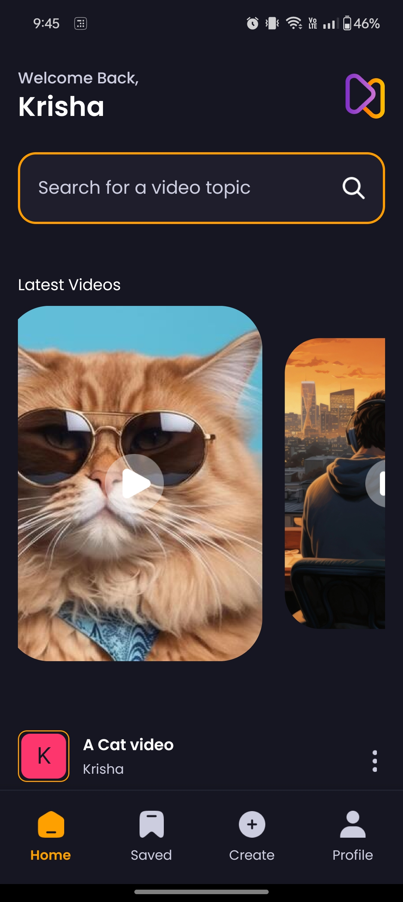
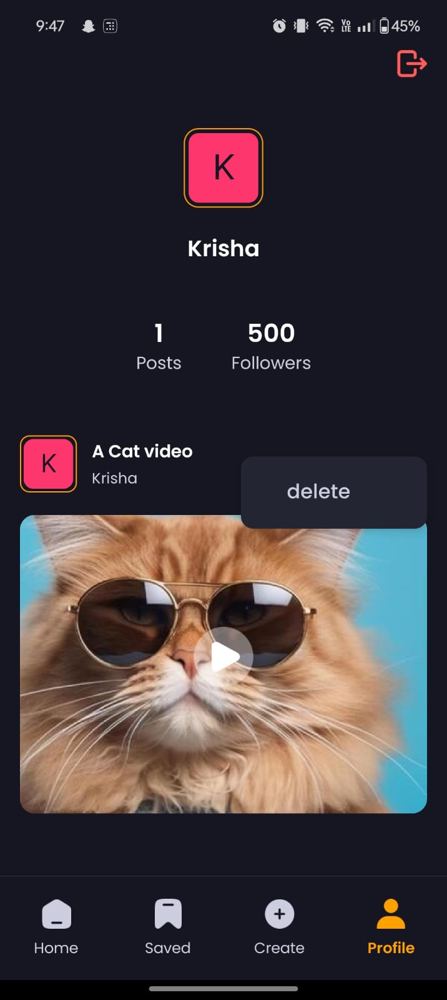
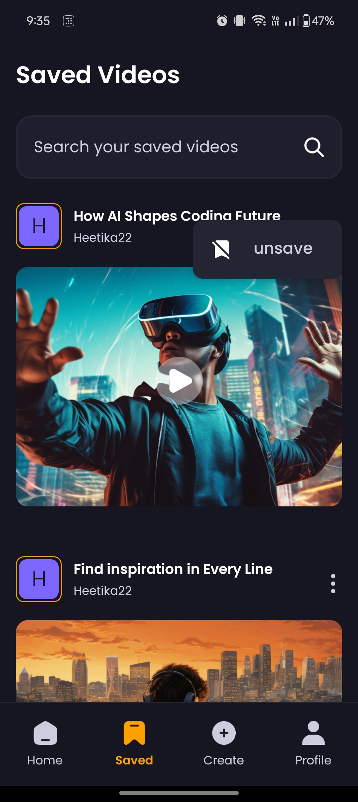
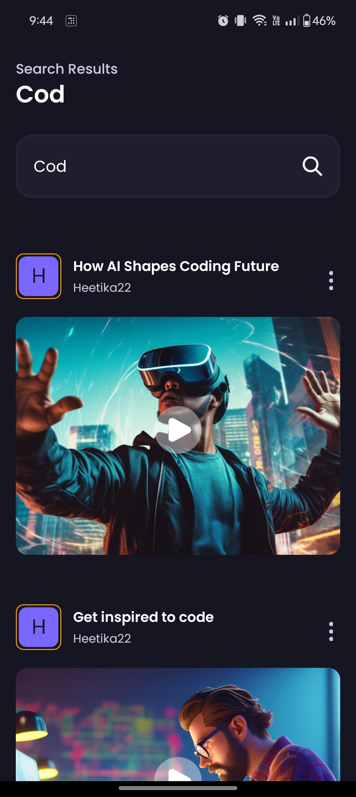

# Video Sharing App- AORA

## Overview

This is a mobile application built with Expo and React Native that allows users to share videos, save or unsave them, and delete them. The app provides an intuitive and seamless user experience for interacting with video content, including viewing, saving, and managing videos.

## Features

- **User Authentication:** Secure login and signup functionality.
- **Video Sharing:** Users can upload and share videos with others.
- **Save/Unsave Videos:** Users can save their favorite videos for easy access and unsave them when they no longer wish to keep them.
- **Delete Videos:** Users can delete their own videos from the platform.
- **User Profiles:** Each user has a profile displaying their uploaded videos.
- **Search Functionality:** Users can search for videos using keywords.

## Tech Stack

- **Frontend:** React Native, Expo
- **Backend:** Appwrite (for backend services and storage)
- **Storage:** Appwrite (for video and thumbnail storage)
- **Authentication:** Appwrite Authentication
- **Other Libraries:** Nativewind

## Database Structure

### Collections

#### Users

| Attribute | Type   |
|-----------|--------|
| username  | String |
| email     | Email  |
| avatar    | URL    |
| accountId | String |

#### Videos

| Attribute  | Type                                                  |
|------------|-------------------------------------------------------|
| title      | String                                                |
| thumbnail  | URL                                                   |
| prompt     | String                                                |
| video      | URL                                                   |
| creator    | Relationship (many-to-one with Users collection)      |
| saved_by   | Relationship (many-to-many with Users collection)     |

## Backend and Storage

This app leverages [Appwrite](https://appwrite.io/) for most backend services including user authentication, database management, and file storage. Appwrite simplifies the backend development by providing APIs and SDKs for various services.

### How Appwrite is Used

- **Authentication:** Appwrite's authentication services are used to manage user sign-up, login, and authentication.
- **Database:** Appwrite's built-in database is used for managing video metadata and user interactions.
- **File Storage:** Videos and thumbnails are stored using Appwrite's file storage services.

## Screenshots

Here are some screenshots of the app:

### Home Screen


### Video Player
.jpg)

### Profile page


### Saved Videos


### Upload Video
.jpg)

### Search Video


## Getting Started

### Prerequisites

- Node.js and npm installed
- Expo CLI installed globally (`npm install -g expo-cli`)
- An account on Appwrite

### Installation

1. **Clone the repository:**

    ```bash
    git clone https://github.com/Heetika22/Aora---Video-Sharing-App.git
    cd AORA
    ```

2. **Install dependencies:**

    ```bash
    npm install
    ```

3. **Setup Appwrite Configuration: (you will get them from Appwrite console, just copy paste the id)**

    setup in lib/appwrite.js

    APPWRITE_ENDPOINT=your_appwrite_endpoint
    APPWRITE_PROJECT_ID=your_appwrite_project_id
    DATABASE_ID= your_database_id 
    USER_COLLECTION_ID= user_collection_id
    VIDEO_COLLECTION_ID= video_collection_id
    STORAGE_ID: your_appwrite_storage_id

    ```

4. **Run the application:**

    ```bash
    npx expo start -c
    ```


### Usage

- **Register/Login:** Create a new account or login with existing credentials.
- **Upload Video:** Navigate to the upload section and select a video to share.
- **Save Video:** Tap the save button on any video to add it to your saved list.
- **Unsave Video:** Tap the unsave button on any saved video to remove it from your list.
- **Delete Video:** Tap the delete button on any video you have uploaded to remove it from the platform.

## Project Structure
AORA/
│
├── assets/ # Assets such as images, fonts, etc.
├── components/ # Reusable components
├── context/ # Global context and provider
├── app/ # Screen components
├── lib/ # Utility functions and API calls
├── package.json # Project dependencies and scripts
├── screenshots # glimpses of the app
└── README.md # Project documentation

## Contributing

Contributions are welcome! Please fork this repository and submit a pull request for any features, bug fixes, or enhancements.
1. **Fork the repository.**
2. **Create a new branch:**
    ```bash
    git checkout -b feature-branch
    ```
3. **Make your changes.**
4. **Commit your changes:**
    ```bash
    git commit -m 'Add new feature'
5. **Push to the branch:**
    ```bash
    git push origin feature-branch
    ```
6. **Open a pull request.**

## Project References

https://youtu.be/ZBCUegTZF7M?si=NLIZFwk3Xv7-x2Go -- Javascript Mastery

New Features apart from this video- 
-- save your favourite videos
-- fetch your saved video in dedicated tab for saved videos with search implementation
-- unsave the videos that you have previously saved
-- delete  from your Profile